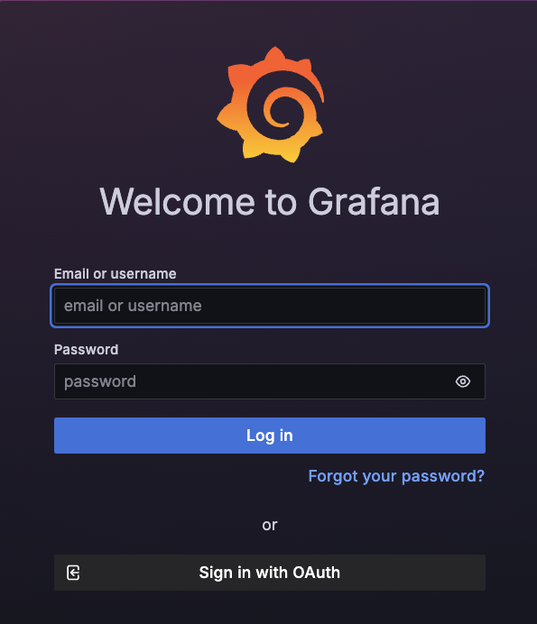
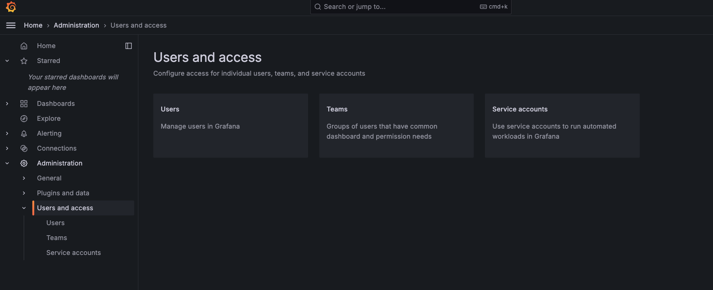

This guide outlines how administrators can manage user access within or outside the organization during Grafana deployment.

#### 1. Setting Up the Admin User

During the Grafana deployment, you can set up the administrator credentials as follows, which will be used to log into the Grafana dashboard:

```
admin:
  # Grafana admin username
  user: "XXXXX"

  # Admin password. If not provided, a random password will be generated
  password: "XXXX"

  # Existing secret containing the admin password
  existingSecret: ""

  # Password key on the existing secret
  existingSecretPasswordKey: password

```

#### 2. Admin Dashboard Access

Once set up, the admin can log into the Grafana dashboard to manage users, teams, and service account access.



In addition to general login methods, I want to highlight the OAuth and LDAP integrations, which simplify organizational member login and avoid complex UI configurations.

#### 3. OAuth Integration

Setting up OAuth is straightforward. It allows organization members to use their authenticator to directly log into the dashboard. Grafana's Helm chart supports embedded OAuth configuration. Here is how you can configure it:

**Step 1: Configure OAuth** Create a ConfigMap for your `grafana.ini` or `custom.ini` settings:

```
apiVersion: v1
kind: ConfigMap
metadata:
  name: grafana-Oauth-cm
data:
  grafana.ini: |
    [analytics]
    check_for_updates = true

    [auth.generic_oauth]
    allow_sign_up = true
    api_url = https://XXXXXX/gateway/am/api/userinfo
    auth_url = https://XXXXX/gateway/discovery?
    client_id = XXXXXXX
    client_secret = XXXXXXXX
    name = OAuth
    scopes = openid
    token_url = https://XXXXXX/gateway/am/api/auth/token
    # use_pkce = true (optional)

    [grafana_net]
    url = https://grafana.net

    [log]
    mode = console

    [paths]
    data = /var/lib/grafana/
    logs = /var/log/grafana
    plugins = /var/lib/grafana/plugins
    provisioning = /etc/grafana/provisioning

    [server]
    domain = XXXXX
    root_url = https://XXXXX

    [users]
    viewers_can_edit = true

```

**Key Points:**

- Set the correct OAuth redirect URL, typically `https://<your ingress host>/login/generic_oauth`.
- To secure sensitive information like the OAuth app's client ID and client secret, consider using a Kubernetes secret.
- Some organizations may require PKCE. Enable it by setting `use_pkce = true`, which will automatically generate `code_challenge` and `code_challenge_method` strings during the discovery phase.

**Step 2: Enable OAuth in Grafana** Specify the ConfigMap in your `values.yaml` file to enable OAuth during deployment:

```
config:
  useGrafanaIniFile: True
  grafanaIniConfigMap: grafana-Oauth-cm
  # grafanaIniSecret: grafana-Oauth-secret (optional, if you want to hide the client_id and client_secret)

```

#### 4. LDAP Integration

LDAP is another straightforward method for allowing organizational members to log into the dashboard without manual configuration.

To enable LDAP, create a ConfigMap with your LDAP settings and deploy the Grafana Helm Chart:

**Step-1: configmap.yaml**:

```
apiVersion: v1
kind: ConfigMap
metadata:
  name: ldap-config
data:
  ldap.toml: |-
    [[servers]]
    host = "ldap"
    port = 389
    use_ssl = false
    start_tls = false
    ssl_skip_verify = false
    bind_dn = "cn=admin,dc=example,dc=org"
    bind_password = 'admin'
    search_filter = "(uid=%s)"
    search_base_dns = ["ou=People,dc=support,dc=example,dc=org"]

    [servers.attributes]
    name = "givenName"
    surname = "sn"
    username = "cn"
    member_of = "memberOf"
    email = "email"

```

**Step-2: Deploy helm using the following parameters in the values.yaml:**

```
ldap.enabled=true
ldap.configMapName=ldap-config
ldap.allowSignUp=true

```
This setup provides a secure and streamlined method for managing user access to the Grafana dashboard.
